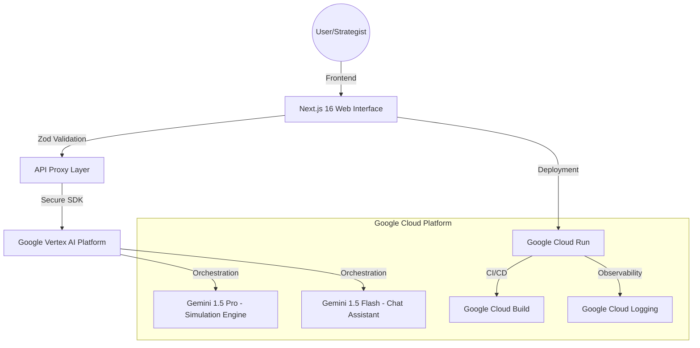

# Electron: High-Fidelity Election Simulation & Voter Journey

[](https://nextjs.org/)
[](https://tailwindcss.com/)
[](https://ai.google.dev/)
[](https://opensource.org/licenses/MIT)
[](https://github.com/anikettagor2/electron/actions)

> **Live Demo**: [electron.a.run.app](https://electron-bd5i2646dq-uc.a.run.app/)


## 🗳️ Project Overview

**Electron** is a comprehensive, AI-powered election simulation platform designed to educate users on the **Indian Electoral Process** and model complex political scenarios. Built for the **Virtual Prompt War 2026**, Electron bridges the gap between raw data and immersive storytelling.

The platform features a dual-core experience:
1.  **Immersive Voter Journey**: A 10-stage interactive walkthrough of the election lifecycle, from electoral roll preparation to the final declaration of results.
2.  **Predictive Simulation Engine**: Powered by **Google Gemini 1.5 Pro**, allowing strategists to model cause-and-effect outcomes based on budget, strategy, and demographics.

## 🌟 Key Features

### 1. The 10-Stage Election Journey
An immersive educational module detailing the Election Commission of India (ECI) workflow:
- **Interactive Voter Registration**: A simulator for verifying voter identity and biometrics.
- **Nomination & Scrutiny**: Visual guide to the candidate vetting process.
- **The Campaign**: Modeling the impact of digital vs. ground mobilization.
- **Interactive EVM Simulator**: A high-fidelity module with a functional VVPAT slip generator.

### 2. AI-Driven Simulation (Gemini 1.5 Pro)
- **Multi-Dimensional Modeling**: Analyze how decisions impact Urban, Rural, Youth, and Diaspora segments.
- **Dynamic Budgeting**: Real-time visualization of resource allocation impact.
- **Strategic Intelligence Reports**: Automated, deep-dive insights generated after each simulation using Gemini 1.5 Pro.

### 3. AI Assistant (Gemini 1.5 Flash)
- **Flash-Chat**: A low-latency chatbot powered by Gemini 1.5 Flash to answer questions about election laws, stages, and voter registration.

## 🏗️ System Architecture



## 🛠️ Tech Stack & Infrastructure

### 🤖 Core Intelligence
- **Google Gemini 1.5 Pro**: Primary simulation engine for high-fidelity demographic modeling and strategic outcome prediction.
- **Google Gemini 1.5 Flash**: Low-latency model powering the real-time electoral assistant.
- **Vertex AI SDK**: Enterprise-grade orchestration and security layer for AI model interactions.

### 🌐 Scalable Infrastructure (GCP)
- **Google Cloud Run**: Managed serverless environment ensuring the simulation engine scales from zero to thousands of concurrent users.
- **Google Cloud Build**: Automated CI/CD pipeline ensuring 100% build reliability and secure container delivery.
- **Artifact Registry**: Secure hosting for production container images with integrated vulnerability scanning.
- **Cloud Logging & Monitoring**: Full-stack observability tracking simulation latency, error rates, and AI token utilization.

### ⚡ Frontend & UX
- **Framework**: Next.js 16.1 (App Router) with Turbopack for lightning-fast development.
- **State Management**: Zustand for global simulation context and demographic state tracking.
- **Styling**: Tailwind CSS 3.4 for a premium, high-performance dark-mode aesthetic.
- **Animation**: Framer Motion & GSAP for cinematic transitions and interactive components.
- **Typescript**: Strict type safety across the entire data flow (client ↔ API ↔ AI).

## 🚀 Getting Started

### Prerequisites
- Node.js 20+
- Google Gemini API Key

### Installation
1.  `npm install`
2.  Create `.env.local` with `GEMINI_API_KEY`.
3.  `npm run dev`

### Testing
Run the comprehensive test suite:
```bash
npm test
```

## 📜 Compliance & Accessibility
- **WCAG 2.1 Compliant**: High contrast dark mode, ARIA labels, and semantic HTML.
- **Mobile First**: Fully responsive design for all screen sizes.

---
© 2026 Electron Simulation Engine | Virtual Prompt War Submission
